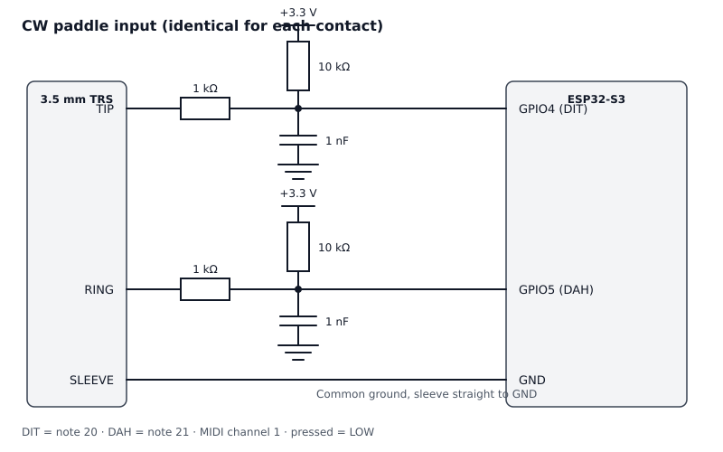

# Hardware

Two identical input channels, one for DIT (tip) and one for DAH (ring). Sleeve is
the common ground.



## Schematic as text

```
3.5 mm TRS                      ESP32-S3

TIP ---- 1k ---------+-------- GPIO4  (DIT)
                     |
                     +-- 10k --- 3.3 V
                     |
                     +-- 1nF --- GND


RING --- 1k ---------+-------- GPIO5  (DAH)
                     |
                     +-- 10k --- 3.3 V
                     |
                     +-- 1nF --- GND


SLEEVE ---------------------- GND
```

## Bill of materials

| Qty | Part                              | Notes                                                   |
|----:|-----------------------------------|---------------------------------------------------------|
|   1 | ESP32-S3 board with native USB    | e.g. ESP32-S3-DevKitC-1, USB-C wired to the S3 itself, not to the UART chip |
|   1 | 3.5 mm stereo jack socket         | TRS, for the paddle lead                                 |
|   2 | Resistor, 1 kOhm                  | in series with tip and ring                              |
|   2 | Resistor, 10 kOhm                 | pull-up to 3.3 V                                         |
|   2 | Capacitor, 1 nF                   | to ground, right at the pin                              |
|   1 | Enclosure                         | anything, as long as the jack and the USB port come out  |

## Why these parts

**10 kOhm pull-up to 3.3 V.** The input sits cleanly at HIGH when nothing is
happening, and goes LOW when the paddle contact closes to sleeve. The pull-up is
external on purpose rather than the controller's internal one: it is reliably low
impedance enough to stay put with a long, exposed paddle lead hanging off it in
an RF field. The pin is configured as plain `INPUT` in the sketch for that
reason, with no internal pull-up.

**1 kOhm in series.** Limits the current into the controller's protection diodes
when static discharge or RF arrives on the lead. With the contact closed, the 1k
/ 10k divider leaves about 0.3 V at the pin, comfortably below the LOW threshold.

**1 nF to ground.** Together with the resistors this forms a low-pass filter. The
falling edge (contact closes) has a time constant of roughly 1 us, the rising
edge (contact opens) roughly 10 us. That is orders of magnitude faster than any
keyed element, but it swallows RF from your own PA and the fastest contact
bounce. Mount the capacitor as close to the GPIO pin as you can.

## Build notes

* Use the **native** USB port of the ESP32-S3. On many boards the second port
  goes through a UART bridge chip and cannot do USB MIDI at all.
* Keep the paddle lead short and star the jack ground back to the board ground.
* Running high power? Put a ferrite on the paddle lead and another on the USB
  cable, both close to the enclosure.
* With a single lever paddle or a straight key, wire tip only. Ring stays HIGH
  through its pull-up and never sends anything.
